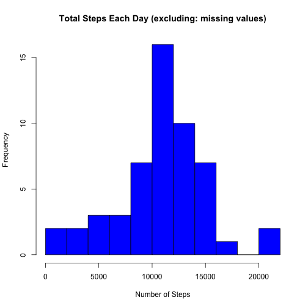
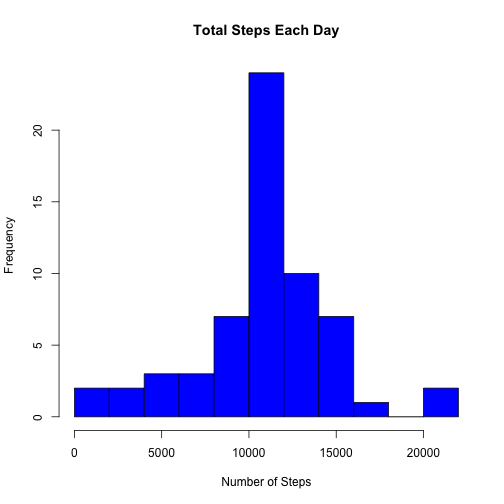
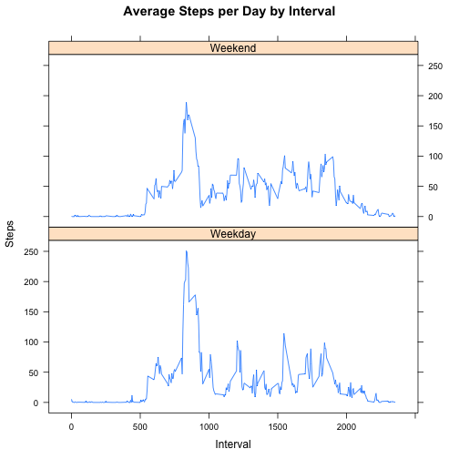

## Load Data
=========


```r
library(lattice)
library(knitr)
library(ggplot2)

data <- read.csv("activity.csv")
```

## Mean total number of steps taken per day:


```r
steps_by_day <- aggregate(steps ~ date, data, sum)
hist(steps_by_day$steps, main = paste("Total Steps Each Day (excluding: missing values)"), col="blue",breaks = 10, xlab="Number of Steps")
```

 

```r
Step_mn <- mean(steps_by_day$steps)
Step_md <- median(steps_by_day$steps)
```

The mean and median total number of steps taken per day are 10766.19 and 10765 respectively. 


## What is the average daily activity pattern?


```r
steps_by_interval <- aggregate(steps ~ interval, data, mean)

plot(steps_by_interval$interval,steps_by_interval$steps, type="l", xlab="Interval", ylab="Number of Steps",main="Average Number of Steps per Day by Interval (excluding: missing values)")
```

 

```r
max_interval <- steps_by_interval[which.max(steps_by_interval$steps),1]
```

"835"  5-minute interval, on average across all the days in the dataset, contains the maximum number of steps.


## Imputing missing values


```r
incomplete <- sum(!complete.cases(data))
imputed_data <- transform(data, steps = ifelse(is.na(data$steps), steps_by_interval$steps[match(data$interval, steps_by_interval$interval)], data$steps))

steps_by_day_i <- aggregate(steps ~ date, imputed_data, sum)
hist(steps_by_day_i$steps, main = paste("Total Steps Each Day"), col="blue",breaks = 10, xlab="Number of Steps")
```

 

```r
NA_Steps <- is.na(data$steps)
 length(NA_Steps)
```

```
## [1] 17568
```

```r
StepMOD_mn <- mean(steps_by_day_i$steps)
StepMOD_md <- median(steps_by_day_i$steps)
```

Total number of missing values in the dataset (i.e. the total number of rows with NAs are "17568"

The mean and median total number of steps taken per day are 10766.19 and 10766.19 respectively.

The mean values are identical, but median differs slightly. The modified median is equal to the mean values, and is little higher than the original-non-modified median.

The impact of introducing missing values is not significant for this dataset.


## Are there differences in activity patterns between weekdays and weekends?


```r
weekdays <- c("Monday", "Tuesday", "Wednesday", "Thursday", 
              "Friday")
imputed_data$dow = as.factor(ifelse(is.element(weekdays(as.Date(imputed_data$date)),weekdays), "Weekday", "Weekend"))

steps_by_interval_i <- aggregate(steps ~ interval + dow, imputed_data, mean)

library(lattice)

xyplot(steps_by_interval_i$steps ~ steps_by_interval_i$interval|steps_by_interval_i$dow, main="Average Steps per Day by Interval",xlab="Interval", ylab="Steps",layout=c(1,2), type="l")
```

 

More steps are taken during weekend. Although, overall, the difference is not much.


